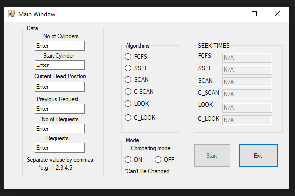

# Disk-scheduling-algorithms
This is a Disk Scheduling Algorithm Demonstration using C#
### Algorithms:
*FCFS  
*SSTF  
*SCAN  
*C-SCAN  
*LOOK  
*C-LOOK  
### Input
1- Number of Cylinders in the Disk  
2- Start Cylinder  
3- Current Head Position  
4- Previous Request  
5- Number of Requests  
6- The Requests _**Separated By Commas**_  
7- Choose the Algorithm needed  
8- Comparison Mode (Used When you need to compare more than one Algorithm)  

### Output
The output is the seek time alongside a grapgh.
